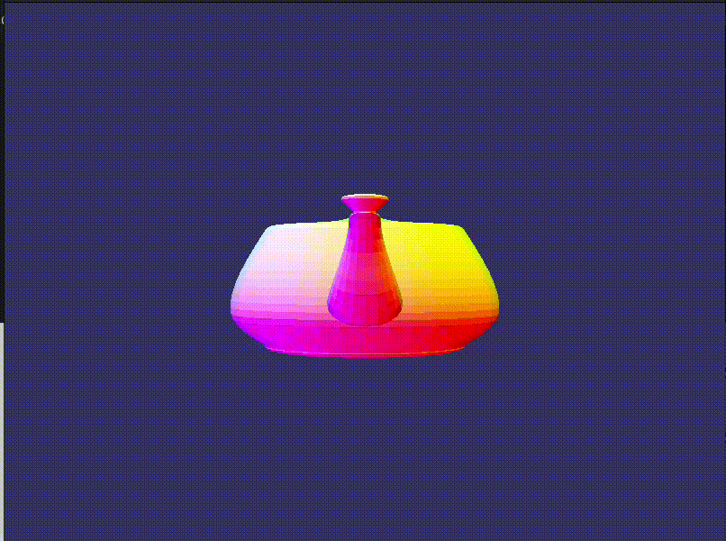

# Scop

This project consist of rendering with a perspective view the basic content of an .obj file.

## features :
- Display an .obj file in perspective.
- Translate, rotate and scale the object on it's three axis.
- Apply a default texture on the object (Mapped using provided texture coordinate or proceduraly).
- 5 different colours rendering mode :
  - A grey scale.
  - Material colour (If provided by a material file).
  - 'Material scale'.
  - Normal (Faces colours are replaced by the values of it's Normal Vector).
  - 'Material normal' (Mix between 'Material colour' and 'Normal').
- Wireframe view.
- Zoom.
- Auto rotation around the X,Y and Z axis.

## Tech
- Language : C
- Graphic API : OpenGL
- Library : GLFW

### Preview :

#### 42 logo with grey scale colour mode

#### Minecraft bee with material colours, followed by the wireframe mode

#### Teapot with 'Material normal' colour mode

#### 42 logo with a texture of a minecraft beehive (Procedural texture mapping)

